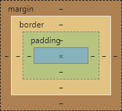
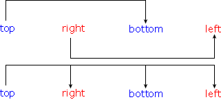

# CSS

## 引入CSS

```html
<link rel="stylesheet" type="text/css" href="style.css" />
```

## Display

### block

独占一行的元素，这类元素不论如何调整宽度，始终独占一行。
常见的块元素有：`p`、`h1`、`h2`、`h3`、`br`、`div`等。
`p`元素不能包含任意块元素。

### inline

只占自身宽度的元素。
常见的内联元素有：`a、`span`等。
一般不用内联元素包含块元素

### inline-block

既能设置宽高，也不会独占一行。
常见的行内块元素有：`img`、`iframe`等。

## 隐藏元素

- `style='display: none'`：不占据空间
- `style='visibility: hidden'`：占据空间，无法点击；再次显示`style='visibility: visible'`。
- `style='opacity: 0'`：占据空间，可以点击；再次显示`style='opacity: 1'`。

## 选择器

### 基础选择器

- `tag_name {}`：标签选择器
- `.cls_name {}`：类选择器
- `#id_name {}`：ID选择器
- `* {}`：通配选择器

### 高级选择器

- `selector1,selector2 {}`：并集选择器
- `selector2selector2 {}`：交集选择器（若有标签选择器，则必须为第一个）
- `selector2:not(selector2) {}`：排除选择器
- `selector1+selector2 {}`：兄弟选择器（后一个紧挨的平级标签）
- `selector1~selector2 {}`：兄弟选择器（后边所有的平级标签）
- `selector1 selector2 {}`：后代选择器（后代的后代也可被选中）
- `selector1>selector2 {}`：子元素选择器（必须为直系）

### 伪类选择器

- `a:link {}`：未访问过的链接
- `a:visited {}`：访问过的链接，只能设置字体颜色
- `selector:hover {}`：鼠标悬停时样式
- `selector:active {}`：鼠标点击时样式
- `input:focus {}`：文本框获得焦点时样式
- `selector::selection {}`：（Chrome）选中的文字样式
- `selector::-moz-selection {}`：（Firefox）选中的文字样式
- `selector:first-child {}`：（当前容器内）第一个子元素
- `selector:last-child {}`：（当前容器内）最后一个子元素
- `selector:nth-child(n) {}`：（当前容器内）第n个子元素
- `selector:nth-child(even) {}`：（当前容器内）偶数位置
- `selector:nth-child(odd) {}`：（当前容器内）奇数位置
- `selector:first-of-type {}`：第一个元素
- `selector:last-of-type {}`：最后一个元素
- `selector:nth-of-type {}`：第n个元素

### 伪元素择器

- `p:first-letter {}`：首字母样式
- `p:first-line {}`：首行样式
- `p:before {content:"[前]";color:red;}`：每行之前，添加内容
- `p:after {content:"[后]";color:orange;}`：每行之后，添加内容

### 属性选择器

- `selector[attr] {}`：选取含有指定属性的元素
- `selector[attr1][attr2] {}`：同时含有属性attr1和attr2的元素
- `selector[attr="value"] {}`：含有指定属性且值为value的元素
- `selector[attr|="value"] {}`：含有指定属性且值为value或值以value开头的元素
- `selector[attr^="head"] {}`：含有指定属性且值以head开头的元素
- `selector[attr$="tail"] {}`：含有指定属性且值以tail结尾的元素
- `selector[attr*="content"] {}`：含有指定属性且值包含content的元素
- `selector[attr~="content"] {}`：含有指定属性且值以空格断句时可出现content的元素

## 长度单位

### 绝对长度

| Value  | Explain |
| :- | :-: |
| px | 像素
| cm | 厘米
| mm | 毫米

### 相对长度

| Value  | Explain |
| :-  | :-: |
| %   | 100% = 包含块的高或宽
| em  | 1 em = 1 当前元素的 font-size
| rem | 1 rem = 1 根元素的 font-size

## 盒子模型



- padding: 内边距
  - `padding: top right bottom left;`
- border: 边框
  - `border: width style color`
  - `border-width: top right bottom left`
  - `border-style: top right bottom left`
  - `border-color: top right bottom left`
- margin: 外边距
  - `margin: top right bottom left;`

## 边框样式

| Value   | Effect |
| :-:     | :-: |
| none	  | 无边框
| hidden  |	无边框，用于解决`table`边框冲突
| dotted  |	点状
| dashed  |	虚线
| solid	  | 实线。
| double  |	双线
| groove  |	3D 凹槽
| ridge	  | 3D 垄状
| inset	  | 3D inset
| outset  |	3D outset
| inherit |	从父元素继承边框样式。

### 缩写规则



### 垂直外边距折叠

```html
<style>
    .test-container {background-color: bisque}
    .Resolve-margin-top-deliver:before {content: ''; display: table}
    .s-box {width: 50px; height: 50px}
    .m-box {width: 75px; height: 75px}
    .l-box {width: 100px; height: 100px}
</style>
<h2>相邻兄弟元素之间的垂直外边距以最大值决定</h2>
<p>两个盒子上下间距为100px</p><hr>
<div class="test-container">
    <div class="s-box" style="background-color: darkcyan; margin-bottom: 100px;"></div>
    <div class="s-box" style="background-color: fuchsia; margin-top: 50px;"></div>
</div>
<h2>子元素的上外边距会传递给父元素</h2>
<p>外层盒子上边距50px</p><hr>
<div class="test-container">
    <div class="l-box" style="background-color: darkcyan;">
        <div class="s-box" style="background-color: fuchsia; margin-top: 50px;"></div>
    </div>
</div>
<h2>解决外边界传递</h2>
<p>内层盒子距外层盒子上边距50px</p><hr>
<div class="test-container">
    <div class="l-box Resolve-margin-top-deliver" style="background-color: darkcyan;">
        <div class="s-box" style="background-color: fuchsia; margin-top: 50px"></div>
    </div>
</div>
```

### 内容溢出

```html
<style>
    .test-container {background-color: bisque}
    .box1 {background-color: darkcyan; width: 50px; height: 50px}
    .box2 {background-color: fuchsia; width: 25px; height: 100px}
</style>
<h2>溢出内容直接可见</h2><hr>
<div class="test-container" style="overflow: visible">
    <div class="box1">
        <div class="box2"></div>
    </div>
</div>
<h2>溢出内容不可见</h2><hr>
<div class="test-container" style="overflow: hidden">
    <div class="box1">
        <div class="box2"></div>
    </div>
</div>
<h2>增加滚动条</h2><hr>
<div class="test-container" style="overflow: scroll">
    <div class="box1">
        <div class="box2"></div>
    </div>
</div>
<h2>溢出后再自动增加滚动条</h2><hr>
<div class="test-container" style="overflow: auto">
    <div class="box1">
        <div class="box2"></div>
    </div>
</div>
```

### clearfix

解决浮动布局高度塌陷和外边界传递（兼容IE6）

```css
.clearfix {zoom: 1}
.clearfix:before, .clearfix:after {
    content: '';
    display: table;
    clear: both;
}
```

## 布局

### 浮动布局

```html
<style>
    .test-container {background-color: bisque}
    .Resolve-height-collapse1 {overflow: hidden; zoom:1}
    .Resolve-height-collapse2 { zoom:1 }
    .Resolve-height-collapse2:after {content: ''; display: block; clear: both}
    /* zoom: 是兼容IE6的代码 */
    .box1 {background-color: darkcyan; width: 50px; height: 50px}
    .box2 {background-color: fuchsia; width: 50px; height: 50px}
    .box3 {background-color: brown; width: 50px; height: 50px}
    .box4 {background-color: cornflowerblue; width: 50px; height: 50px}
</style>
<h2>浮动</h2>
<p>子元素浮动时，不能撑开父元素</p>
<p>子元素浮动范围由父元素的上左右位置决定</p>
<p>浮动元素不会覆盖父元素的内容</p>
<hr>
<div class="test-container" style="width: 300px">
    <div class="box1" style="float: left">1</div>
    <div class="box2" style="float: left">2</div>
    <div class="box3" style="float: right">3</div>
    <div class="box4" style="float: right">4</div>
    父元素内容
</div><div style="background-color: coral">浮动后内容</div>
<h2>解决浮动塌陷1</h2><hr>
<div class="test-container Resolve-height-collapse1" style="width: 300px">
    <div class="box1" style="float: left">1</div>
    <div class="box2" style="float: left">2</div>
    <div class="box3" style="float: right">3</div>
    <div class="box4" style="float: right">4</div>
    父元素内容
</div><div style="background-color: coral">浮动后内容</div>
<h2>清除浮动</h2><hr>
<div class="test-container" style="width: 300px">
    <div class="box1" style="float: left">1</div>
    <div class="box2" style="float: left">2</div>
    <div class="box3" style="float: right">3</div>
    <div class="box4" style="float: right">4</div>
    父元素内容
</div><div style="background-color: coral; clear: both">浮动后内容</div>
<h2>解决浮动塌陷2（推荐）</h2><hr>
<div class="test-container Resolve-height-collapse2" style="width: 300px">
    <div class="box1" style="float: left">1</div>
    <div class="box2" style="float: left">2</div>
    <div class="box3" style="float: right">3</div>
    <div class="box4" style="float: right">4</div>
    父元素内容
</div><div style="background-color: coral">浮动后内容</div>
```

### [Flex布局](./flex.html)

- [参考教程](http://www.ruanyifeng.com/blog/2015/07/flex-grammar.html)